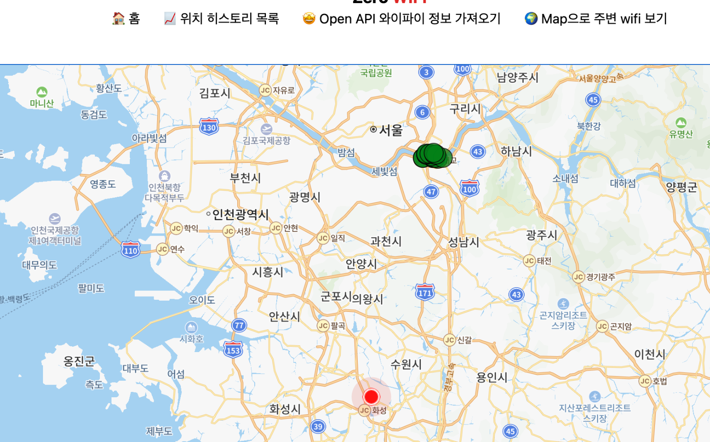
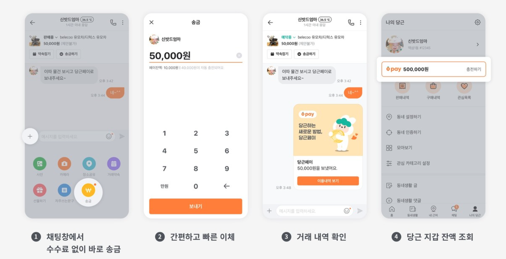
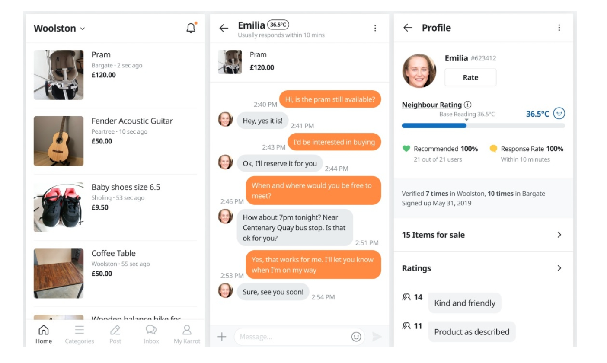
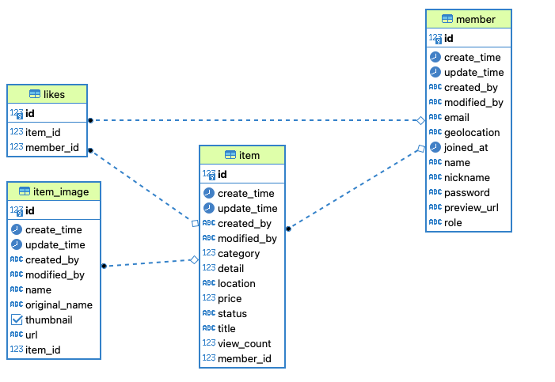
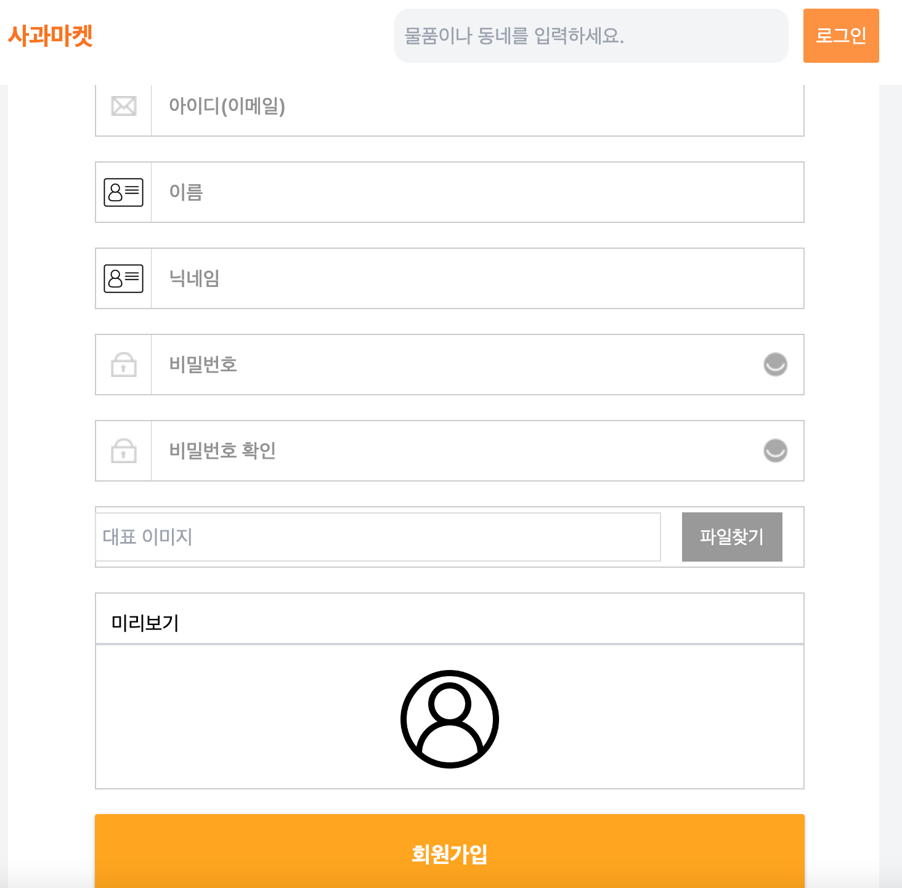
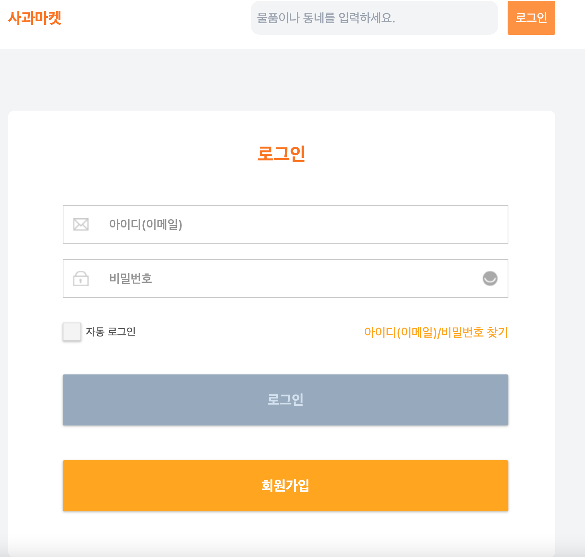
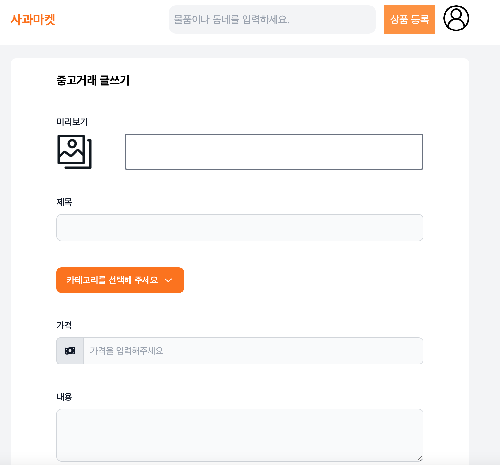
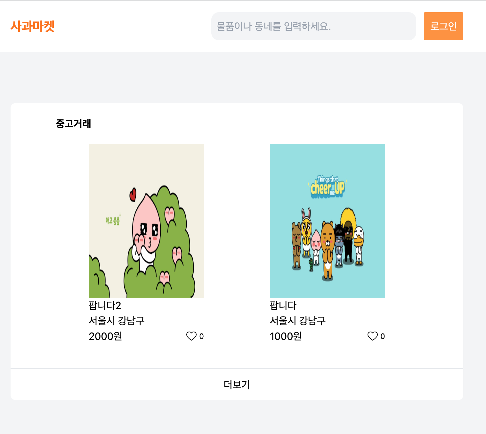
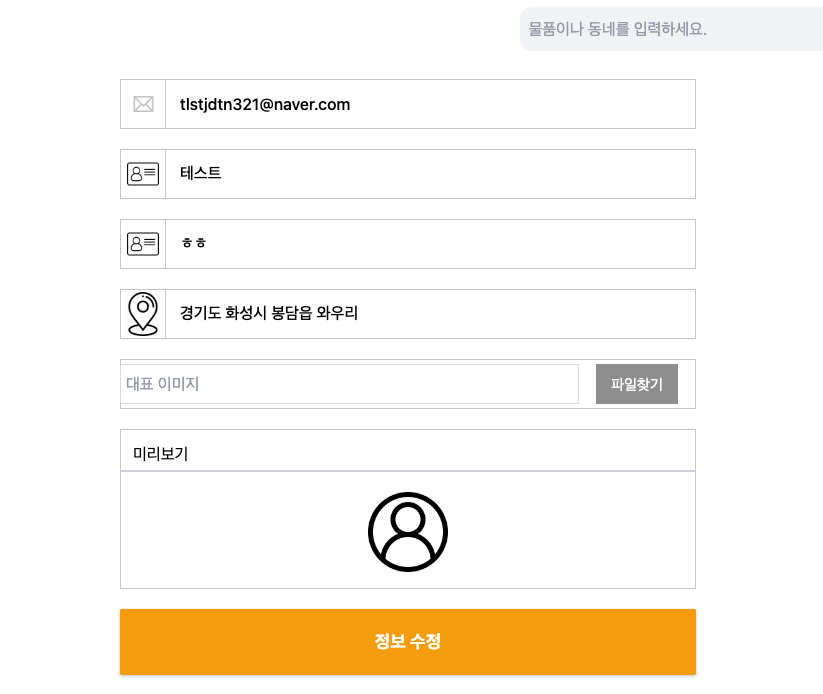
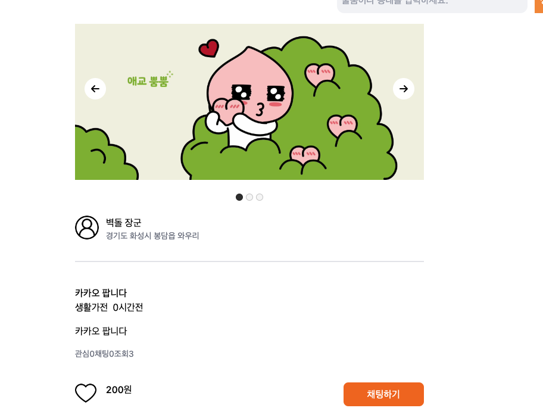

# 당근마켓 만들어보기

## 🤔 why? 당근마켓인가..

첫 프로젝트인 공공데이터 와이파에서 위치 데이터를 사용한 경험이 있는데, 이 프로젝트에 사용하고 싶다.

- 첫프로젝트 사진)

- 게시판은 물론 websocket을 이용한 채팅 프로그램을 만들어보고 싶었다.
- 당근마켓에서는 당근페이와 같은 선불카드만 있지만 나는 아임포트를 넣어 간편결제로 사는 형식으로 만들어보고 싶었다.
- 무지 멘토님과 효진 멘토님처럼 멀티쓰레드 관련하여 기능을 넣고 싶었다. (Webflux? ThreadPoll?)

- front는 thymeleaf로 만들것같은데.. 다국어 지원도 해보고 싶었다.

### 사용한 라이브러리

  &nbsp 
  &nbsp 
  &nbsp
  &nbsp
   
  &nbsp 
  &nbsp

## 진행 사항

### ERD 상태

### 구현 기능

- [x] 회원가입
    - [x] 회원가입 기능구현 (회원가입 시, 위도경도 조회후 주소 저장)
    - [x] 회원 화면 만들기
    

- [x] 로그인 화면
  - [x] 로그인 화면 만들기
  - [x] 스프링 시큐리티로 로그인 구현
  

- [x] 상품 등록
  - [x] 상품 등록 화면 만들기
  - [x] 상품 등록 기능 구현 
  

- [x] 메인화면
  - [x] 현재 등록된 상품들을 보여준다.

- [x] 마이페이지
  - 내 정보 수정 기능 추가
  - 화면단 구성

- [x] 상품 상세 페이지
  - 데이터 가져오기 추가